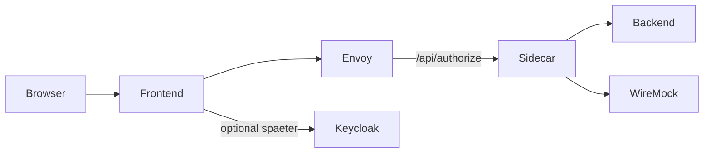

# k8s-auth-sidecar Demo (einfach erklaert)

Diese Demo zeigt in einfacher Form, wie ein Frontend, ein Backend und der `k8s-auth-sidecar` zusammenspielen.

Ziel der Demo:
- Du siehst klar, wann ein Zugriff erlaubt ist.
- Du siehst klar, wann ein Zugriff abgelehnt ist.
- Das Backend bleibt absichtlich einfach und hat keine eigene Auth-Logik.

---

## Was ist in diesem Projekt drin?

- `frontend/`: Web-UI mit Next.js 15 (TypeScript, Tailwind)
- `backend/`: einfacher FastAPI-Service mit Demo-Endpunkten
- `infra/envoy/`: Envoy als API-Gateway (mit `ext_authz`)
- `sidecar/`: Sidecar-nahe Policy-/Config-Dateien
- `keycloak/`: Realm-Import fuer spaetere echte OIDC-Tests
- `wiremock/`: Mock-Services fuer den stabilen Demo-Mode
- `infra/k8s/`: Kubernetes-Manifeste mit Kustomize (`base` + `overlays`)
- `docker-compose.yml`: lokaler Start mit einem Befehl

---

## Architektur (vereinfacht)



In Worten:
- Das Frontend schickt API-Requests an Envoy.
- Envoy fragt den Sidecar, ob der Request erlaubt ist.
- Der Sidecar erlaubt oder verweigert.
- Nur bei "erlaubt" wird zum Backend weitergeleitet.

---

## Aktueller Modus: Demo-Mode (stabil)

Der Stack ist aktuell absichtlich auf einen sehr stabilen Demo-Mode gestellt.

Das bedeutet:
- `NEXT_PUBLIC_DEMO_MODE=true` im Frontend
- Sidecar mit `AUTH_ENABLED=false` und `AUTHZ_ENABLED=false`
- OIDC- und Rollen-Daten kommen aus WireMock
- Erlaubt/Verweigert wird in der Demo ueber spezielle Backend-Endpunkte sichtbar gemacht

Warum ist das gut?
- Die Demo ist schnell reproduzierbar.
- Du kannst den Flow zeigen, auch wenn kein "echter" Token-Flow gebraucht wird.

---

## Schnellstart (lokal)

### 1) Starten

```bash
docker compose up --build
```

### 2) Wichtige URLs

- Frontend: [http://localhost:3000](http://localhost:3000)
- Envoy Gateway: [http://localhost:18080](http://localhost:18080)
- Sidecar direkt: [http://localhost:8090](http://localhost:8090)
- Backend direkt: [http://localhost:8082](http://localhost:8082)
- Keycloak: [http://localhost:8081](http://localhost:8081)
- WireMock OIDC: [http://localhost:8091](http://localhost:8091)
- WireMock Roles: [http://localhost:8089](http://localhost:8089)

### 3) Demo im Browser

1. Frontend oeffnen.
2. Auf `/userinfo laden` klicken.
3. `Meine Bestellungen` klicken (`/api/orders`) -> erwartet `200`.
4. `Admin-Bereich laden` klicken (`/api/admin`) -> erwartet `403`.

Erwartete Darstellung:
- Gruen = erlaubt
- Rot = verweigert (mit Begruendung)

---

## Test ohne Frontend

Du kannst den Flow direkt mit `curl` pruefen:

```bash
curl -i http://localhost:18080/userinfo
curl -i http://localhost:18080/api/orders
curl -i http://localhost:18080/api/admin
```

Erwartung im Demo-Mode:
- `/userinfo` -> `200`
- `/api/orders` -> `200`
- `/api/admin` -> `403`

---

## Devbox (empfohlen)

Die Devbox sorgt dafuer, dass alle Entwickler dieselben Tools benutzen.

### 1) Devbox installieren

```bash
curl -fsSL https://get.jetpack.io/devbox | bash
```

### 2) Devbox-Shell starten

```bash
devbox shell
```

Hinweis:
- OPA wird in dieser Umgebung bewusst **nicht** aus Nix gebaut (um bekannte Build-Probleme auf macOS ARM zu umgehen).
- Beim Start der Devbox-Shell wird automatisch ein passendes OPA-Binary nach `.devbox/bin/opa` geladen.

Optional mit `direnv`:

```bash
direnv allow
```

### 3) Tooling testen und Setup ausfuehren

```bash
devbox run doctor
devbox run setup
```

### 4) Stack starten/stoppen

```bash
devbox run up
devbox run down
devbox run logs
```

---

## Keycloak und Entra ID (einfach erklaert)

Der Sidecar kann mit verschiedenen Identity Providern arbeiten:
- Keycloak
- Microsoft Entra ID

Grundidee:
- Ein Token kommt rein.
- Der Sidecar prueft Token-Daten gegen die OIDC-Konfiguration.
- Wenn Werte nicht zusammenpassen, gibt es oft `401`.

### Wichtige Variablen

- `OIDC_AUTH_SERVER_URL`: OIDC-URL vom Realm/Tenant
- `OIDC_CLIENT_ID`: Client-ID, fuer die der Token ausgestellt wurde
- `OIDC_TOKEN_ISSUER`: erwartete `iss`-Claim (optional, aber oft noetig)

### Beispiel fuer Keycloak

```bash
OIDC_AUTH_SERVER_URL=http://keycloak:8080/realms/sidecar-demo
OIDC_CLIENT_ID=demo-frontend
OIDC_TOKEN_ISSUER=http://localhost:8081/realms/sidecar-demo
```

Wichtig zu verstehen:
- Container sprechen meist ueber Servicenamen wie `keycloak`.
- Browser und Host sehen oft `localhost`.
- Beide Welten muessen bei OIDC sauber zusammenpassen.

### Beispiel fuer Entra ID

```bash
OIDC_AUTH_SERVER_URL=https://login.microsoftonline.com/<TENANT_ID>/v2.0
OIDC_CLIENT_ID=<APPLICATION_CLIENT_ID>
OIDC_TOKEN_ISSUER=https://login.microsoftonline.com/<TENANT_ID>/v2.0
```

### Wo wird das gesetzt?

- Lokal: `docker-compose.yml` im Service `auth-sidecar`
- Kubernetes: `infra/k8s/base/backend-deployment.yaml` im Sidecar-Container

---

## Kubernetes Deployment (lokaler Cluster)

### Voraussetzungen

- `kubectl`
- `kustomize`
- ein lokaler Cluster (z. B. `kind` oder `k3d`)

### 1) Images bauen

```bash
docker build -t sidecar-demo/backend:latest ./backend
docker build -t sidecar-demo/frontend:latest ./frontend
```

Bei `kind` zusaetzlich:

```bash
kind load docker-image sidecar-demo/backend:latest
kind load docker-image sidecar-demo/frontend:latest
```

### 2) Deploy ausfuehren

```bash
kubectl apply -k infra/k8s/overlays/development
kubectl get pods -n sidecar-demo
```

### 3) Ports nach lokal forwarden

```bash
kubectl port-forward -n sidecar-demo svc/frontend 3000:3000
kubectl port-forward -n sidecar-demo svc/envoy 18080:8080
kubectl port-forward -n sidecar-demo svc/keycloak 8081:8080
```

---

## Sidecar-Injection-Beispiel

Wenn du einen bestehenden Service hast, findest du ein Beispiel hier:
- `infra/k8s/overlays/development/sidecar-injection-example.yaml`

Das zeigt, wie der Sidecar-Container zusaetzlich in einen vorhandenen Pod kommt.

---

## Typische Fehler und schnelle Loesungen

- `401 Unauthorized` bei allen Requests  
  -> OIDC-Werte passen nicht (`OIDC_AUTH_SERVER_URL`, `OIDC_CLIENT_ID`, `OIDC_TOKEN_ISSUER`)

- `403 Forbidden` bei Admin-Endpunkt  
  -> In dieser Demo oft erwartet (zeigt die Verweigerung korrekt)

- Port belegt (`bind ... already allocated`)  
  -> Pruefe lokale Portkonflikte, in dieser Demo wird Envoy auf `18080` genutzt

- "Lokal geht, im Cluster nicht"  
  -> Unterschied zwischen `localhost` und internen Service-Namen pruefen

---

## Wichtiger Hinweis zum Projektziel

Diese Demo ist nicht als produktionsreifes IAM-Template gedacht, sondern als leicht verstaendliche Lern- und Praesentationsumgebung fuer den Sidecar-Flow.

Wenn du willst, kann als naechster Schritt ein zweiter Compose-Modus "real-oidc" ergaenzt werden (ohne Demo-Bypass, mit echtem Keycloak-Login und echter Tokenpruefung).
